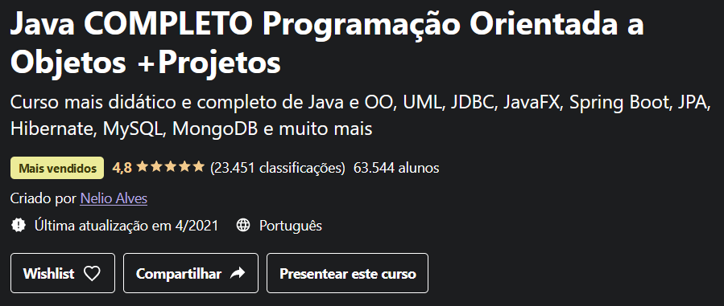

<h1 align="center">
    Java Completo
</h1>

    
    
    
    

 

    

 

## Technologies
- Java 11

## Project
This is a repository that contains all the exercises solved in [Nelio Alves' Complete Java course on Udemy](https://www.udemy.com/course/java-curso-completo/).

## Status
In progress 🚧

## License
This project is under the MIT License. See [LICENSE](/LICENSE.md) file for more details.