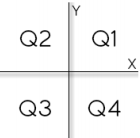

# Lista 2

## Exercício 1
Fazer um programa para ler um número inteiro, e depois dizer se este número é negativo ou não.

## Exercício 2
Fazer um programa para ler um número inteiro e dizer se este número é par ou ímpar.

## Exercício 3
Leia 2 valores inteiros (A e B). Após, o programa deve mostrar uma mensagem "Sao Multiplos" ou "Nao sao Multiplos", indicando se os valores lidos são múltiplos entre si. Atenção: os números devem poder ser digitados em ordem crescente ou decrescente.

## Exercício 4
Leia a hora inicial e a hora final de um jogo. A seguir calcule a duração do jogo, sabendo que o mesmo pode começar em um dia e terminar em outro, tendo uma duração mínima de 1 hora e máxima de 24 horas.

## Exercício 5
Com base na tabela abaixo, escreva um programa que leia o código de um item e a quantidade deste item. A seguir, calcule e mostre o valor da conta a pagar.

    

## Exercício 6
Você deve fazer um programa que leia um valor qualquer e apresente uma mensagem dizendo em qual dos seguintes intervalos ([0,25], (25,50], (50,75], (75,100]) este valor se encontra. Obviamente se o valor não estiver em nenhum destes intervalos, deverá ser impressa a mensagem “Fora de intervalo”.

## Exercício 7
Leia 2 valores com uma casa decimal (x e y), que devem representar as coordenadas de um ponto em um plano. A seguir, determine qual o quadrante ao qual pertence o ponto, ou se está sobre um dos eixos cartesianos ou na origem (x = y = 0). Se o ponto estiver na origem, escreva a mensagem “Origem”. Se o ponto estiver sobre um dos eixos escreva “Eixo X” ou “Eixo Y”, conforme for a situação.

    

